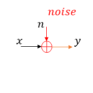
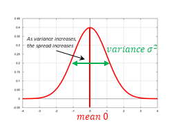
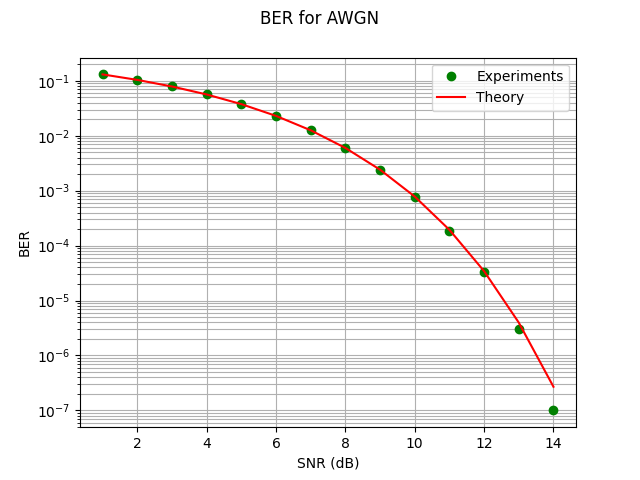

# Performance Analysis for Communication Systems 

Bit Error Rate (BER) is a metric which can be employed to characterize the performance of a communication system. In communication system, one transmits bits of information from 
the transmitter to receiver. However, all the transmitted bits are not received correctly by the receiver; frequently there are bit errors occuring during the communication process.

In this first project, we will present the analytical theory behind the probability error of AWGN channel for BPSK modulated transmission. Moreover, we simulate using Python this system model
and we present its bit error rate performance.

The project report contains the definition and the expression of : 
* [Bit Error Rate ](#BER)
* [Information bits ](#Information-bits)
* [Detection at Receiver ](#Detection-at-Receiver)
* [Model of Wireline Communication system ](#Model-of-Wireline-Communication-system)
* [Probability error expression ](#Probability-error-expression)

## BER
The BER is the average rate of bit error. For instance, if 10 000 bits are transmetted and 100 bits are received in error, then the average BER:

Since the transmitted and the received bits are random quantities, the BER can also be expressed as probability known as the probability of bit error.

## Information bits

Note that the information bits are modulated prior to transmission over the channel. One such modulation format is BPSK : Binary Phase Shift Keying, in which, the information symbol 0 is modulated as []!(https://latex.codecogs.com/gif.latex?%5Csqrt%7BP%7D) and the infomation symbol 1 is modulated as 
[]!(https://latex.codecogs.com/gif.latex?-%5Csqrt%7BP%7D).
So, there are two phases 0 and 180 degrees. The average power of this modulation format is P.

## Detection at Receiver

If the received symbol >= 0 then it is mapped to the binary information 0 else it is mapped to 1. In this case, 0 is the threshold.
This is a threshold based detection.

## Model of Wireline Communication system

In the figure bellow, we present a simple model of a wireline communication system, where x is the transmitted symbol, y the received symbol and n is the noise at the receiver.

If the noise process is a white Gaussian, then the system model is a AWGN (additive White Gaussian Noise). 
The noise probability density function for a zero 0 and noise power  is given by: 

The shape of the pdf is as depicted in the Figure below:

## Probability error expression

Consider , then the received symbol .
The bit error occurs if  meaning 

Therefore, the probability of error is given by:

This corresponds to the  where Q is the qfunction, and it is expressed by:

To sum up, the probability of bit error in AWGN channel for BPSK modulated transmission of average power P is given by:

By defining the SNR : Signal to Noise Power Ratio by : 

![equation1] (https://latex.codecogs.com/gif.latex?%5Ctext%7BSNR%7D%20%3D%20%5Cfrac%7BP%7D%7B%5Csigma%5E2%7D)

Then, the probability of error is thus .

Through our simulation using Python, the resulted BER curve against the theoretical probability of error is depicted in the figure below: 

